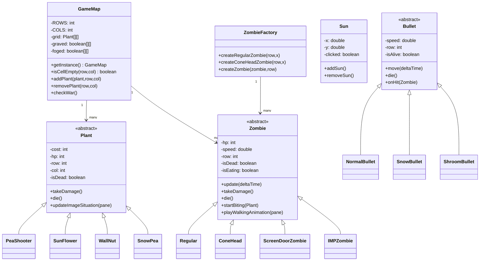
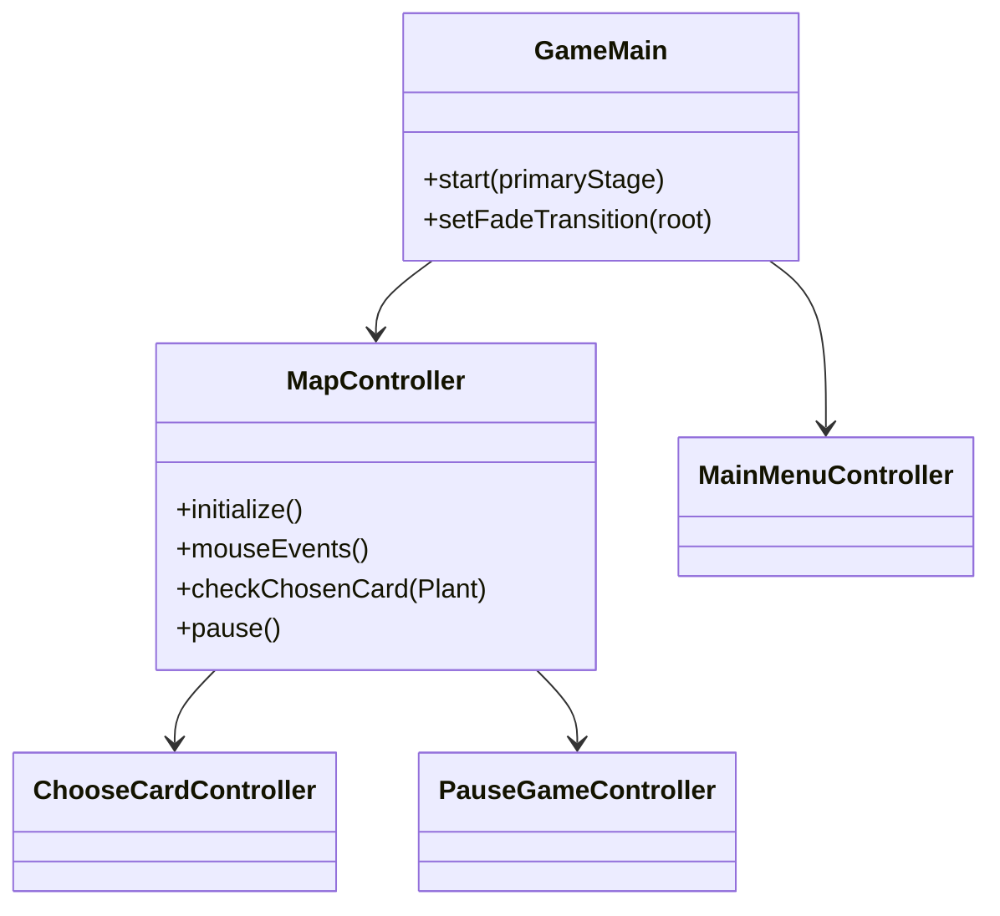
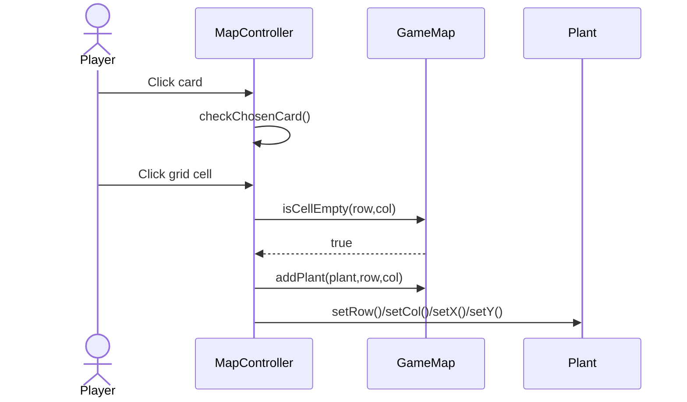
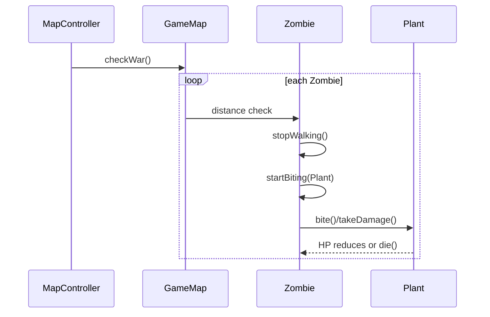
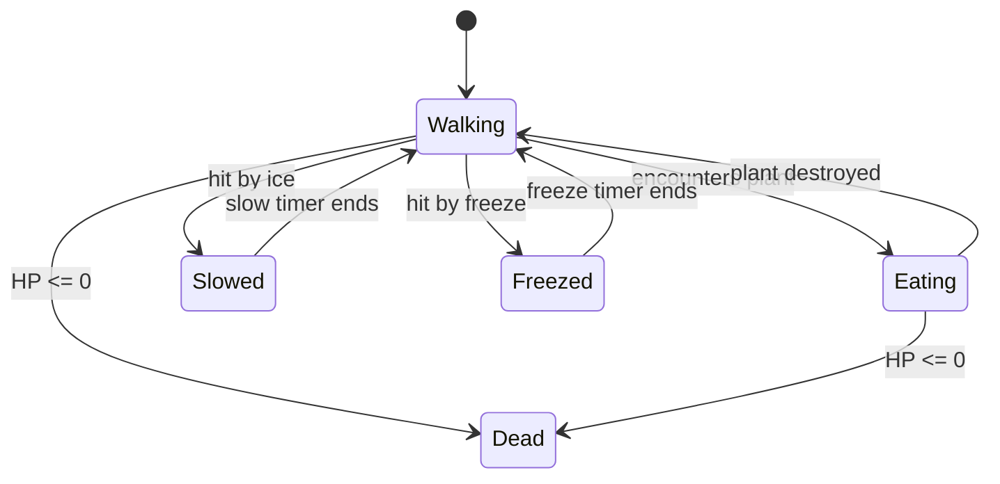
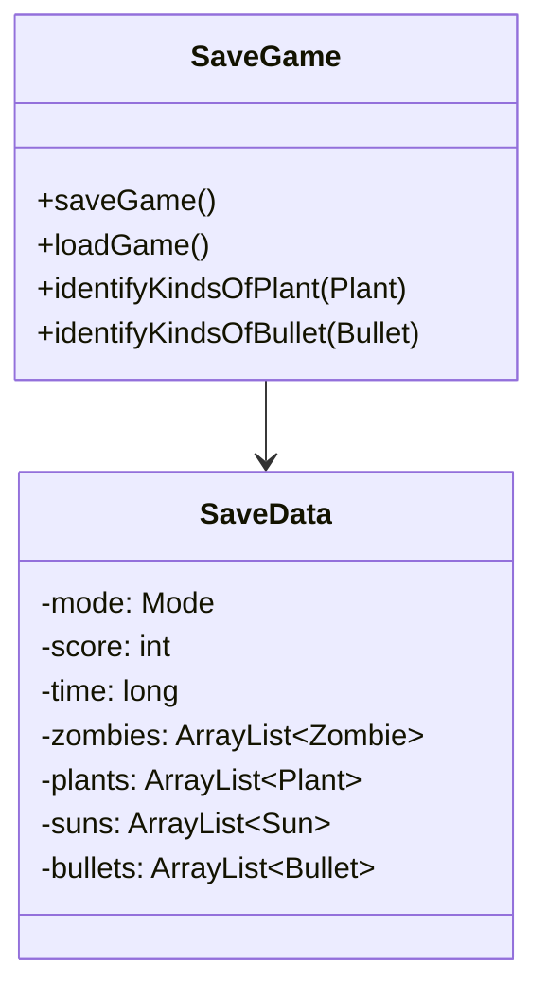
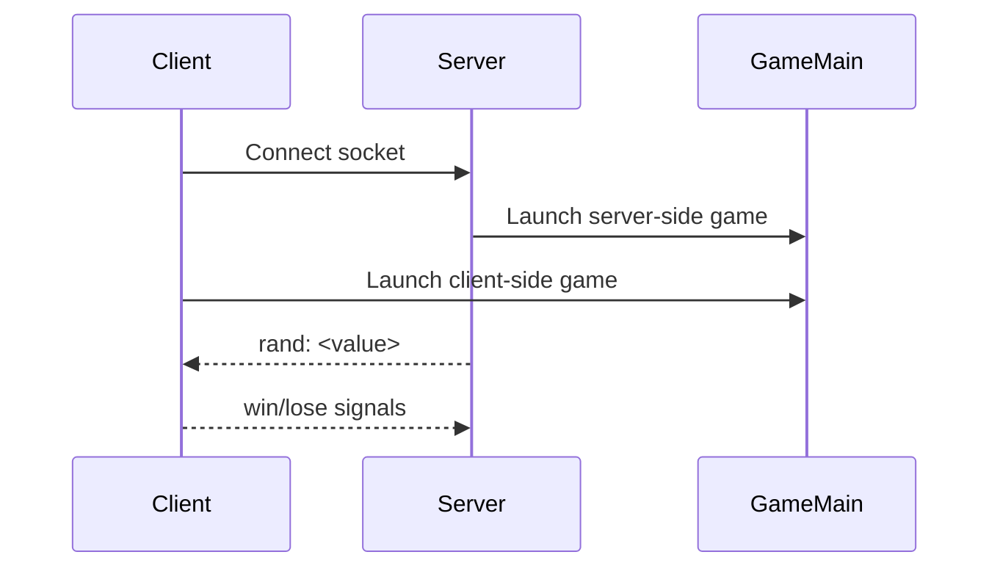

# Plants vs Zombies Clone - UML Design Document

## 1. Purpose and Scope
This document provides a comprehensive UML-oriented design overview of the Plants vs Zombies clone. It focuses on how the core gameplay, UI flow, persistence, and networking are structured in the current implementation.

Scope includes:
- Core gameplay entities (Plants, Zombies, Bullets, Sun).
- Map/grid and entity lifecycle management.
- UI controllers and application flow.
- Save/load serialization.
- Client/server synchronization helpers.

## 2. High-Level Architecture
The project is organized around four primary subsystems:

1. **Gameplay Domain**
   - Plants, zombies, bullets, sun tokens, and their behaviors.
   - Game map grid for placement and combat interactions.

2. **UI & Interaction**
   - JavaFX controllers for menus, card selection, map interaction, and pause flow.
   - Game loop timing and user input handling.

3. **Persistence**
   - Serialization for saving and loading game state.

4. **Networking (Optional)**
   - Client/server helpers for synchronized randomization and win/lose signaling.

## 3. Class Diagram (Core Gameplay)


### Explanation
- **GameMap** is a singleton responsible for grid placement and combat checks between plants and zombies.
- **Plant** is an abstract base class containing shared stats (cost, HP) and lifecycle methods.
- **Zombie** is an abstract base class for movement, eating, and state effects (slowed, frozen, hypno, etc.).
- **Bullet** models projectile movement and hit behaviors.
- **Sun** represents collectible currency increments.
- **ZombieFactory** encapsulates zombie creation and registration.

## 4. UI & Control Flow Diagram


### Explanation
- **GameMain** boots the JavaFX application and loads the main menu scene.
- **MapController** orchestrates gameplay, card selection, event handling, and the main game loop.
- Other controllers handle menu navigation, card selection UI, and pause/win/lose states.

## 5. Sequence Diagram: Placing a Plant


## 6. Sequence Diagram: Zombie Attack Loop


## 7. Activity Diagram: Main Game Loop
```mermaid
flowchart TD
    A[Start Game Loop] --> B[Update Progress Bar]
    B --> C{Win/Lose?}
    C -- Yes --> D[Pause + End Game]
    C -- No --> E[Update Cursor/Fog]
    E --> F[Spawn Sun (day mode)]
    F --> G[checkWar()]
    G --> H[Handle Zombie Waves]
    H --> I[Sync Win/Lose State]
    I --> A
```

## 8. State Diagram: Zombie Lifecycle


## 9. Persistence (Save/Load) Diagram


### Explanation
- **SaveData** is a serializable snapshot of the core game state.
- **SaveGame** constructs SaveData and reconstructs entity lists on load.

## 10. Networking (Client/Server) Diagram


### Explanation
- Server and client exchange win/lose signals and seed-like random values for consistent gameplay events.

## 11. Design Notes & Key Patterns
- **Singleton**: GameMap is instantiated once via `getInstance()`.
- **Factory**: ZombieFactory centralizes zombie creation and registration.
- **Inheritance**: Abstract base classes Plant, Zombie, Bullet define shared behavior and are specialized by concrete entities.
- **Serialization**: SaveData captures runtime state for persistence.

## 12. Future Extension Points
- Add more plant/zombie subclasses with unique skills.
- Extend SaveData to include additional UI/animation state if needed.
- Introduce AI or strategy modules for advanced waves.
- Extract interfaces for testability in MapController.

## 13. Glossary
- **HP**: Hit points of plants/zombies.
- **Wave**: A timed zombie attack batch.
- **Fog**: Night mode visibility obstruction.
- **Hypno**: Zombie converted to attack other zombies.
